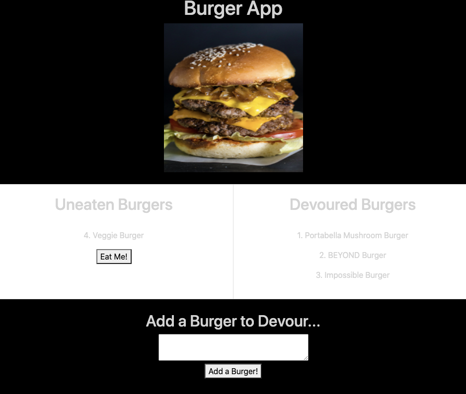

# BurgerApp
This app was created as a restaurant app. It allows users to input the type of burger they would like to eat. Once the user adds a burger the burger will be moved to the uneaten column. After the user clicks the "Eat Me!" button, the burger will be moved to the devour column. Use the following link to see the Heroku deployed app. https://eatyummyburgers.herokuapp.com/ 

## Technologies Used
```MySQL, Node, Express, Handlebars and a homemade ORM```

## License
[](https://opensource.org/licenses/MIT)

## Images


## Questions
Please conatct me with any questions at alberte.laventure@gmail.com